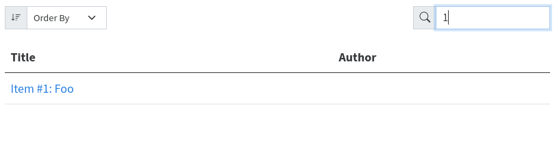

# Quarto listing filter issue

Sometimes when using a "listing" the filter functionality doesn't always behave as
expected. The unexpected behavior is non-deterministic.


## How I created this repo

1. Create the project
   ```
   quarto create-project demo-filter-issue --type=website
   ```
1. Change the `index.qmd` to a "table"-type listing
1. Create the `items` dir and populate with 4 markdown files with numbered titles
1. Remove `about.qmd`


## How to reproduce this issue

1. `quarto preview`
1. In your browser on the index page, try filtering the listing for `1`, `2`, `3`, and
   `4` separately.
1. At least one of these filter attempts will not actually cause any filtering. If this
   doesn't happen, delete `.quarto` and `_site` directories and start over. Each time,
   the behavior should be different. E.g. the first time filtering for `1` may be
   ineffective, and next time filtering for `4` may be ineffective, and the next time
   both `1` and `2` will not be filterable.


## Screenshots




